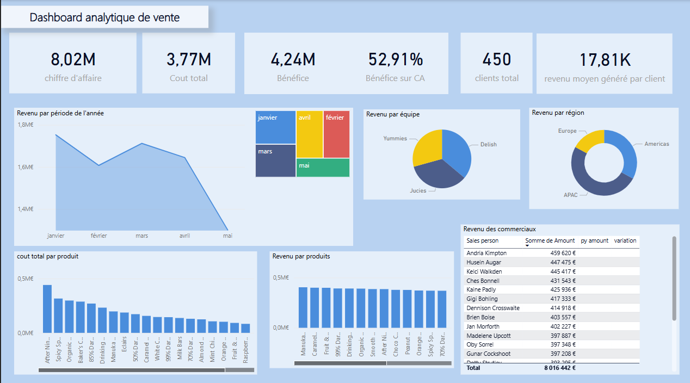

# 📊 Power BI Sales Dashboard

Ce projet présente un dashboard interactif réalisé avec Power BI, basé sur des données commerciale. Il permet d’analyser les performances par mois, les produits les plus vendus, les plus coûteux, les revenus générés, les bénéfices etc.

## 📁 Contenu du dépôt

- `pbix/` : Fichier Power BI complet (`.pbix`) avec rapport d'analyse (`.pdf`)
- `data/` : Données sources (échantillon anonymisé si nécessaire)
- `assets/` : Captures d’écran du dashboard

## 📌 Fonctionnalités clés

- Total des ventes par période de l'année
- Comparaison avec le mois précédent
- Produits les plus vendus
- produits les plus coûteux
- Analyse des revenus par région et par équipe commerciale
- Bénéfice et coût total
- Interactivité entre visuels

## 🚀 Comment l'utiliser

1. Télécharger le fichier `.pbix` depuis le dossier `pbix/`
2. L’ouvrir dans Power BI Desktop
3. Si nécessaire, modifier les chemins d’accès aux données locales

## 📸 Aperçu

## 📄 Licence

Distribué sous licence MIT. Voir `LICENSE` pour plus de détails.
